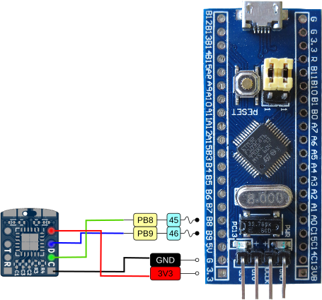
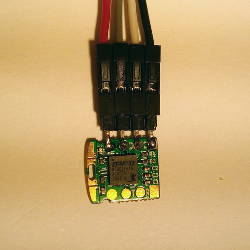

How to use tomu with Black Magic Probe
======================================

Introduction
------------

The [Black Magic Probe](https://github.com/blacksphere/blackmagic/wiki)/BMP is a debugger for various ARM devices which includes the EFM32 series.

You can buy a [full model](https://1bitsquared.com/products/black-magic-probe) but the interresting part is that it's open source. Therefore, it is possible for flash the firmware on various equipement, for example stlink-like probes.

Here we use the [bluepill hardware](http://wiki.stm32duino.com/index.php?title=Blue_Pill). It's a cheap microcontroller which can be transformed in a good BMP.

You can find easily on internet how to transform a normal bluepill into a BMP, it is not covered here. We used [this repository](https://github.com/UweBonnes/blackmagic/tree/bluepill) on the branch bluepill. Please keep in mind that the pins are different than the master branch. If you use the master branch, change accordingly.

Requirements
------------

Hardware:

 - Bluepill with BMP firmware on it
 - 1 tomu
 - Cables

Software

 - Regular toolchain for gcc/gdb arm

Connecting the BMP and tomu
---------------------------

Connect as following:

 - PB9 is SWDIO
 - PB8 is SWCLK
 - 3V3 is VCC
 - GND is GND

You can refer to the following schematics to see how the connection is done (original bluepill pintout is from http://reblag.dk/stm32/).



It can be easier for debugging to temporary solder connections on the tomu debug pads. You can see it here in action



Once connected, you can debug the tomu as follow.

Debugging
---------

```bash
arm-none-eabi-gdb --ex 'target extended-remote /dev/ttyACM0'
```

Once in gdb, you can scan to find the ID of tomu (should be 1):
```
(gdb) monitor swdp_scan
Target voltage: Not Detected
Available Targets:
No. Att Driver
 1      EFM32 Happy Gecko
```

Attach to the EFM32
```
(gdb) attach 1
Attaching to Remote target
warning: No executable has been specified and target does not support
determining executable automatically.  Try using the "file" command.
0x000003bc in ?? ()
```

From there you can use regular gdb commands, such as `info all` etc. to get the status of the program.

To start a compiled sample, do the following:
```
(gdb) file blinky.elf 
A program is being debugged already.
Are you sure you want to change the file? (y or n) y
Reading symbols from blinky.elf...done.
(gdb) load blinky.elf 
Loading section .text, size 0x1904 lma 0x0
Loading section .ARM.exidx, size 0x8 lma 0x1904
Loading section .data, size 0x440 lma 0x190c
Start address 0x534, load size 7500
Transfer rate: 12 KB/sec, 750 bytes/write.
```

You can then `continue` and have source debugging.

For example,
```
(gdb) frame
#0  0x000003b8 in SpinDelay (millis=500) at main.c:46
46	  while (uptime_millis < sleep_until);
```

Benefits
--------

With this method, you can debug even without bootloader the different programs on tomu.
Also, you can use the following macro in your programs:

```c
#define DEBUG_BREAK()           __asm__("BKPT #0");
```

It will break properly inside the debugger.

TODO
----

Document the various interactions with the differents bootloaders.

Try and document if the serial output is working.