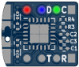
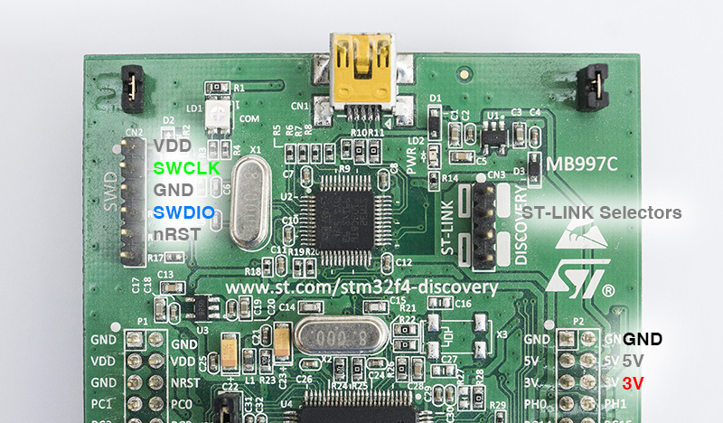

## OpenOCD Flashing ##

In order to make flashing `tomu` boards more accessible, this directory
contains information, scripts and configurations to allow flashing of the
`tomu` using a Raspberry Pi and [two-wire debugging][swd]. While these
configurations are specifically for a Raspberry Pi, the setup should be similar
for any system that allows you to use GPIO pins and can run GNU/Linux (and
OpenOCD of course).

[swd]: https://en.wikipedia.org/wiki/JTAG#Serial_Wire_Debug

### Setup ###

I'm currently working on a set of scripts to make this much simpler, but at the
moment setting up your Raspberry Pi has to be done manually. This includes
compiling OpenOCD from source (which can be done with the 
[build-openocd.sh](build-openocd.sh) script). 

The tutorial I used can be found [here][adafruit-tut], though setting up 
networking is out of scope for that tutorial.

This installs all of the necessary configurations to use two-wire debugging to
flash a `tomu`. After installing OpenOCD you can flash your `tomu` by running
`sudo openocd -f raspberrypi-native.conf -f tomu-flash.conf`.
This will flash the prebuilt dfu firmware (located at /prebuilt/toboot.bin) to the tomu.
You may need to write your own interface configuration file for other devices.

[adafruit-tut]: https://learn.adafruit.com/programming-microcontrollers-using-openocd-on-raspberry-pi

### Wiring ###

Contrary to its name, two-wire debugging (or more accurately "Serial Wire
Debug") uses four wires: `vcc`, `swdio`, `swdclk`, and `ground`. Looking at the
image below of the back of the `tomu`, that is the left-to-right order of
solder pads. The colour coding is `red=vcc`, `blue=swdio`, `green=swdclk`,
`square=ground`.



It is not necessary to solder anything to your `tomu` in order to flash it. If
you have a steady hand you can just hold the wires in place for the couple of
seconds it takes to flash a board. I super-glued some breadboard wires together
to ensure the spacing is constant. You can loop openocd invocations by adding
`watch` in front of your flashing command. e.g. `watch openocd -f ...`

The pins used by the configuration files for the Raspberry Pi in this directory
for two-wire debugging are pins `24` and `25` for `swdio` and `swclk`
respectively. As far as I can tell, Raspberry Pi pin numbering **is** backwards
compatible, so if your Raspberry Pi has less pins than in the diagram below
just count the pins from the left. In the diagram, `vcc` is orange and `ground`
is black. Make sure you get the ordering of the pins correct or you'll end up
restarting your board (due to a short-circuit).


If you're flashing a `tomu` with a different board you'll need to figure out
the right pins to use on your own.


### Flashing with ST-Link ###

`tomu` can also be flashed using the `ST-Link v2` programmer. The `ST-Link v2` comes as part of [STM Discovery][stmdisco] and [STM Nucleo][stmnucleo] boards. It can also be bought off eBay/Aliexpress/etc. for 2-5 USD in a USB Stick format.

This example uses an STM32F407 discovery board, however the interface should always be a 6-pin header with a white dot marking for the `VDD` side for all STM Discovery and Nucleo boards. If you have a chinese USB stick, they usually follow the layout of the [10-pin Cortex Debug Connector][cortexdebug] and you'll need to connect to the `VDD`, `GND`, `SWDIO` and `SWDCLK` pins there as well.

For wiring up the Discovery/Nucleo, follow the picture. The coloring of the pins is the same as described under `Wiring`. Also make sure your ST-Link selector jumpers are cleared. Note that Discovery ST-Link does not power the target MCU directly, so power has to come from the host board.



[stmdisco]: http://www.st.com/en/evaluation-tools/stm32-mcu-discovery-kits.html?querycriteria=productId=LN1848
[stmnucleo]: http://www.st.com/en/evaluation-tools/stm32-mcu-nucleo.html?querycriteria=productId=LN1847
[cortexdebug]: http://www2.keil.com/coresight/coresight-connectors/

After connecting, run:
```
openocd -f interface/stlink-v2.cfg -f tomu-flash.conf
```
